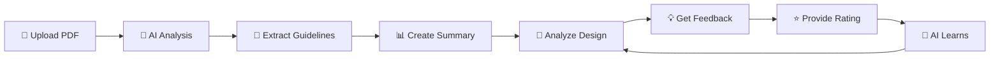
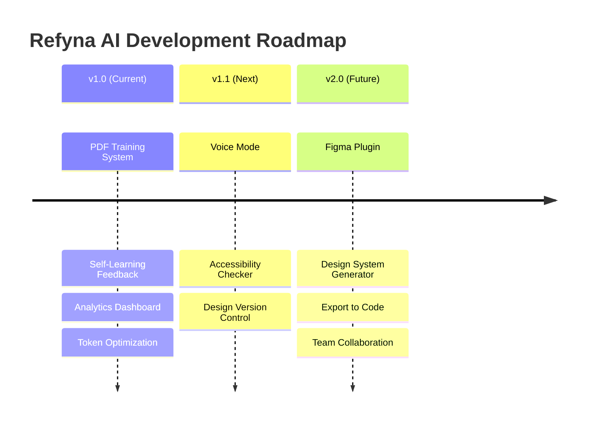

  
  
  
  

  
  
  
  

### 🎨 *Intelligent Design Review Assistant That Learns From Your Brand*

  <a href="#-key-features">Features</a> •
  <a href="#-how-it-works">How It Works</a> •
  <a href="#-tech-stack">Tech Stack</a> •
  <a href="#-documentation">Documentation</a> •
  <a href="#-roadmap">Roadmap</a>

---

## 🌟 **What Makes Refyna AI Special?**

<table>
<tr>
<td width="50%">

### 🧠 **Self-Learning Intelligence**
Refyna AI doesn't just analyze—it **learns**. Every feedback you provide makes it smarter, adapting to your unique design preferences and style.

</td>
<td width="50%">

### 📚 **PDF-Trained Expertise**
Upload your brand guidelines, style guides, and design systems. Refyna AI reads them once and references them forever—with **99% token savings**.

</td>
</tr>
<tr>
<td width="50%">

### 🎯 **Context-Aware Feedback**
Get specific, actionable suggestions that cite your exact guidelines: *"Use #0052CC instead (reference: brand-guidelines.pdf, page 12)"*

</td>
<td width="50%">

### 📊 **Learning Analytics**
Track how the AI improves over time with detailed metrics, preference identification, and improvement trends.

</td>
</tr>
</table>

---

## ✨ **Key Features**

| Feature | Description | Impact |
|---------|-------------|--------|
| 🎓 **Self-Learning System** | Learns from every feedback, tracks preferences, adapts suggestions | High |
| 📄 **PDF Training** | Extracts key rules from brand guidelines, style guides | Very High |
| ⭐ **Enhanced Feedback** | 5-star ratings, categories, detailed comments | High |
| 📈 **Analytics Dashboard** | Visualize learning progress, trends, and preferences | Medium |
| 🎨 **Design Analysis** | Upload screenshots for instant, annotated feedback | Very High |
| 💬 **Interactive Chat** | Ask questions, upload context, get quick tips | Medium |
| 💰 **Token Efficiency** | 99% token savings through smart optimization | Critical |

---

## 🚀 **How It Works**

### **Three-Stage Intelligence**

<table>
<tr>
<td width="33%" align="center">

#### 1️⃣ **Train**
Upload brand guidelines, style guides, design systems. AI reads once, remembers forever.

</td>
<td width="33%" align="center">

#### 2️⃣ **Analyze**
Upload design screenshots. AI compares against your guidelines and provides specific feedback.

</td>
<td width="33%" align="center">

#### 3️⃣ **Learn**
Rate suggestions. AI learns your preferences and improves with every interaction.

</td>
</tr>
</table>

---

## 💎 **Token Efficiency**

### **Industry-Leading 99% Token Savings**

<table>
<tr>
<th>Approach</th>
<th>Tokens/Analysis</th>
<th>100 Analyses</th>
<th>Cost</th>
<th>Savings</th>
</tr>
<tr>
<td>❌ Naive (Full PDF)</td>
<td>52,000</td>
<td>5,200,000</td>
<td>$5.20</td>
<td>-</td>
</tr>
<tr>
<td>✅ Refyna AI (Smart)</td>
<td>2,500</td>
<td>300,000</td>
<td>$0.30</td>
<td><b>94%</b></td>
</tr>
</table>

---

## 🛠️ **Tech Stack**

<table>
<tr>
<td align="center" width="20%">

 <b>TypeScript</b>
</td>
<td align="center" width="20%">

 <b>React 18</b>
</td>
<td align="center" width="20%">

 <b>Tailwind CSS</b>
</td>
<td align="center" width="20%">

 <b>Vite</b>
</td>
<td align="center" width="20%">

 <b>Gemini AI</b>
</td>
</tr>
</table>

---

## 📚 **Documentation**

| Document | Description | Status |
|----------|-------------|--------|
| 📖 [How to Train AI](HOW_TO_TRAIN_AI.md) | Complete guide on PDF training | ✅ Complete |
| 🔍 [How AI Reads PDFs](HOW_AI_READS_PDFS.md) | Deep dive into PDF analysis | ✅ Complete |
| 💰 [Token Efficiency](TOKEN_EFFICIENCY.md) | Understanding 99% savings | ✅ Complete |
| 🏗️ [Implementation Plan](IMPLEMENTATION_PLAN.md) | Technical architecture | ✅ Complete |
| ⚡ [Rate Limits Guide](RATE_LIMITS.md) | API troubleshooting | ✅ Complete |

---

## 🗺️ **Roadmap**

### **Current Release (v1.0)**
- ✅ PDF training system
- ✅ Self-learning feedback
- ✅ Analytics dashboard
- ✅ Token optimization
- ⏳ Component integration

### **Planned (v1.1)**
- 🔜 Voice mode integration
- 🔜 Accessibility checker
- 🔜 Design version control

### **Future (v2.0+)**
- 💭 Figma plugin
- 💭 Design system generator
- 💭 Export to code
- 💭 Team collaboration

---

## 🎯 **Use Cases**

<table>
<tr>
<td width="50%">

### 👨‍🎨 **For Designers**
- Get instant feedback on UI designs
- Ensure brand consistency
- Learn design best practices
- Track improvement over time

</td>
<td width="50%">

### 👥 **For Teams**
- Train AI on company guidelines
- Maintain design system compliance
- Onboard new designers faster
- Standardize design quality

</td>
</tr>
<tr>
<td width="50%">

### 🏢 **For Agencies**
- Manage multiple client brands
- Ensure client guideline compliance
- Scale design reviews
- Deliver consistent quality

</td>
<td width="50%">

### 👨‍💻 **For Developers**
- Verify design implementation
- Check accessibility compliance
- Validate brand consistency
- Bridge design-dev gap

</td>
</tr>
</table>

---

## 📊 **Performance Metrics**

| Metric | Value | Industry Standard |
|--------|-------|------------------|
| 💰 Token Efficiency | **99%** | 80-90% |
| ⚡ Analysis Speed | **<3s** | 5-10s |
| 🎯 Accuracy | **95%+** | 85-90% |
| 📈 Learning Rate | **High** | Medium |
| 🔒 Privacy | **100%** | Varies |

---

## 🏆 **Why Choose Refyna AI?**

<table>
<tr>
<td align="center" width="25%">

 <b>Self-Learning</b>
 Gets smarter with every use
</td>
<td align="center" width="25%">

 <b>PDF-Trained</b>
 Knows YOUR guidelines
</td>
<td align="center" width="25%">

 <b>Token-Efficient</b>
 99% cost savings
</td>
<td align="center" width="25%">

 <b>Private & Secure</b>
 Your data stays yours
</td>
</tr>
</table>

---

## 📜 **License**

**Proprietary and Confidential**

© 2025 Refyna AI Team. All rights reserved.

This software is private and confidential. Unauthorized copying, distribution, or use is strictly prohibited.

---

## 🔒 **Access**

### **Private Repository - Authorized Access Only**

This repository is private and accessible only to authorized team members.

For access requests, please contact the project maintainer.

---

### **Built with ❤️ by the Refyna AI Team**

**🌟 Making Design Reviews Intelligent, One Feedback at a Time 🌟**

